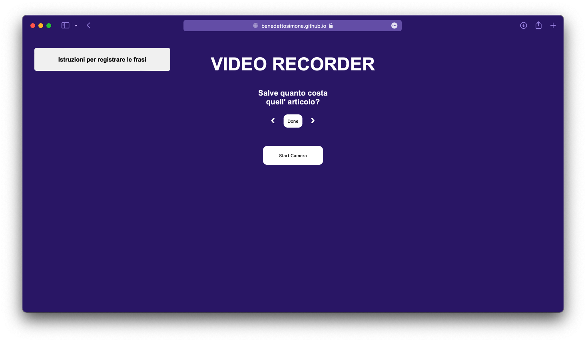

# Video-Recorder

Tool implemented to record videos to build the dataset used in the project https://github.com/BenedettoSimone/researchProject .

## Setup
You can change video constraints and phrases in the ``script.js``.

## Usage
https://benedettosimone.github.io/Video-Recorder/ or clone the repository.
